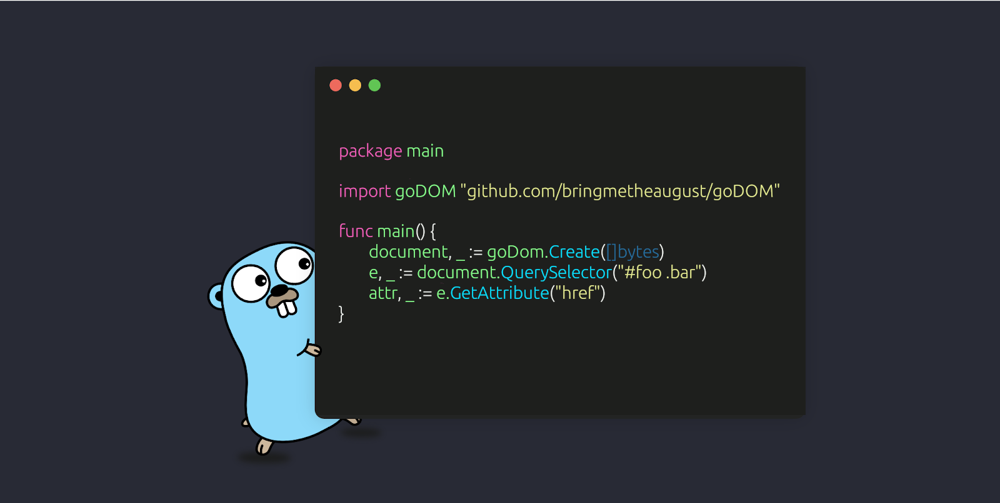

# goDOM

<p align="center">
    <picture>
      
    </picture>
</p>
<p align="center"><b>Easy, yeah?</b></p>
<p align="center">
    <a href="https://pkg.go.dev/github.com/bringmetheaugust/goDOM"></a>
    <a href="https://lh3.googleusercontent.com/proxy/w2a-pc4X9z2kuDWoXKnSF8pY6ngZvjVuZOAXMz3ZR8NwaUj9a-KsJnpcjtUSRO9QtFV6vMb3YoHWWv6k43Cb6bHOJEka19uE54GWtVx7Lru8gi10I_968eA2thkA0dL1O-zA8WT24cI"></a>
    <a href="https://cs4.pikabu.ru/post_img/big/2014/12/15/4/1418619408_1209550583.jpg"></a>
</p>

Made by front-ender for front-enders.   
Package provide method to parse HTML and get browser-like [DOM](https://developer.mozilla.org/en-US/docs/Web/API/Document_Object_Model/Introduction#what_is_the_dom) and DOM API.  
It's only for reading DOM, searching elements and getting their data.
Doesn't have methods to mutate DOM.

⚠️Before using it You should remember that sites can detect You as a bot and return unexpected HTML response.

## Installation

    go get github.com/bringmetheaugust/goDOM

## Examples

 * First, we'll get document

```go
package motherfckrs

import "github.com/bringmetheaugust/goDOM"

func main() {
    bytes :=                                // HTML markup as bytes (from HTTP request, files, etc.)
    document, domErr := goDom.Create(bytes) // create document (DOM with DOM API, like in browser)
    if domErr != nil {return}               // also check if markup is valid
```
 * Find some element by `id`

```go
    el, elErr := document.GetElementById("lol") // <a id="lol" class="pipi" href="http://lol.com">
    if elErr != nil {return}                    // check if element exists
    fmt.Println(el.ClassList)                   // ["pipi"]
    fmt.Println(el.Attributes)                  // {"id": "lol", class: "pipi", "href": "http://lol.com"}
    fmt.Println(el.GetAttribute("href"))        // "http://lol.com"
```

 * Or get a lot of elements by [query selector](https://developer.mozilla.org/en-US/docs/Web/API/Document/querySelectorAll)

```go
    elements, elementsErr := document.QuerySelectorAll(".weee") // all elements in DOM which have class "weee"
    if elementsErr != nil {return}                              // check if elements are existed
    for _, el := range elements {                               // loop slice with existed elements
        // your best code here
    }
```

#### More real examples [here](./examples/).

## Docs

### Document

 * methods

    * [QuerySelector](https://developer.mozilla.org/en-US/docs/Web/API/Document/querySelector) (doesn't support `>`, `+`, `~`, pseudo-elements, pseudo-classes)
    * [QuerySelectorAll](https://developer.mozilla.org/en-US/docs/Web/API/Document/querySelectorAll) (doesn't support `>`, `+`, `~`, pseudo-elements, pseudo-classes)
    * [GetElementById](https://developer.mozilla.org/en-US/docs/Web/API/Document/getElementById)
    * [GetElementsByClassName](https://developer.mozilla.org/en-US/docs/Web/API/Document/getElementsByClassName)
    * [GetElementsByTagName](https://developer.mozilla.org/en-US/docs/Web/API/Element/getElementsByTagName)

 * fields

    * [Title](https://developer.mozilla.org/en-US/docs/Web/API/Document/title)
	* [Body](https://developer.mozilla.org/en-US/docs/Web/API/Document/body)
	* [Head](https://developer.mozilla.org/en-US/docs/Web/API/Document/head)
	* [Links](https://developer.mozilla.org/en-US/docs/Web/API/Document/links)
	* [Images](https://developer.mozilla.org/en-US/docs/Web/API/Document/images)
	* [Doctype](https://developer.mozilla.org/en-US/docs/Web/API/Document/doctype)

### Element

 * methods

    * [GetAttribute](https://developer.mozilla.org/en-US/docs/Web/API/Element/getAttribute)
    * [HasAttribute](https://developer.mozilla.org/en-US/docs/Web/API/Element/hasAttribute)
    * [QuerySelector](https://developer.mozilla.org/en-US/docs/Web/API/Document/querySelector) (doesn't support `>`, `+`, `~`, pseudo-elements, pseudo-classes)
    * [QuerySelectorAll](https://developer.mozilla.org/en-US/docs/Web/API/Document/querySelectorAll) (doesn't support `>`, `+`, `~`, pseudo-elements, pseudo-classes)
    * [GetElementById](https://developer.mozilla.org/en-US/docs/Web/API/Document/getElementById)
    * [GetElementsByClassName](https://developer.mozilla.org/en-US/docs/Web/API/Document/getElementsByClassName)
    * [GetElementsByTagName](https://developer.mozilla.org/en-US/docs/Web/API/Element/getElementsByTagName)

 * fields

    * [TagName](https://developer.mozilla.org/en-US/docs/Web/API/Element/tagName)
    * [TextContent](https://developer.mozilla.org/en-US/docs/Web/API/Node/textContent) element text
    * [Attributes](https://developer.mozilla.org/en-US/docs/Web/API/Element/attributes)
    * [Children](https://developer.mozilla.org/en-US/docs/Web/API/Element/children)
    * [ClassName](https://developer.mozilla.org/en-US/docs/Web/API/Element/className)
    * [ClassList](https://developer.mozilla.org/en-US/docs/Web/API/Element/classList)
    * [Id](https://developer.mozilla.org/en-US/docs/Web/API/Element/id)
    * [ParentElement](https://developer.mozilla.org/en-US/docs/Web/API/Node/parentElement)
	* [NextElementSibling](https://developer.mozilla.org/en-US/docs/Web/API/Element/nextElementSibling)
	* [PreviousElementSibling](https://developer.mozilla.org/en-US/docs/Web/API/Element/previousElementSibling)

## Development

via Makefile

    make install

without Makefile

    sh ./scripts/install
